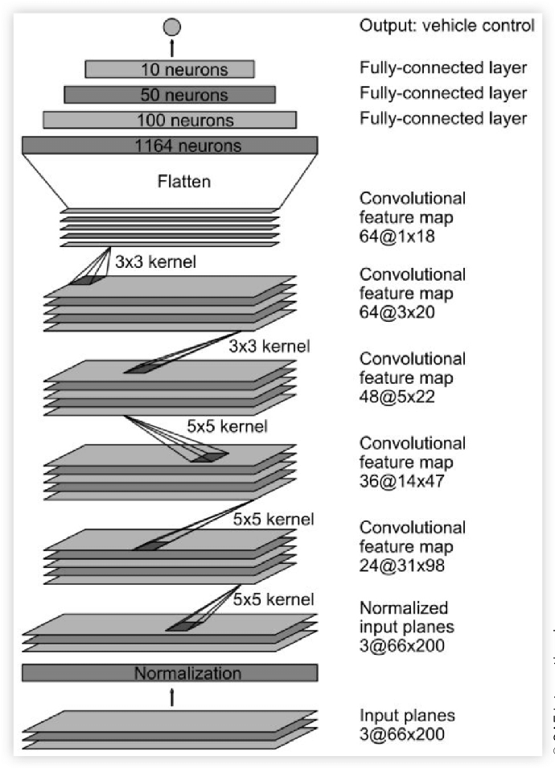
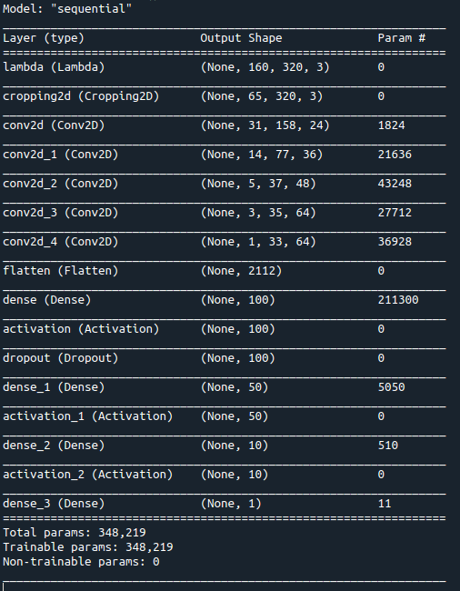
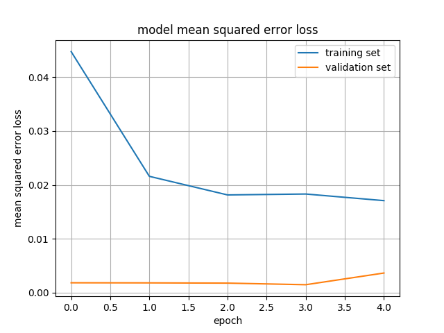

# **Behavioral Cloning** 

#### 1. Model architecture

I adopted model architecture in [Nvidia paper](https://arxiv.org/abs/1604.07316). As our input image shape is (160,320,3), I changed the model input shape from the original nvidia model. I decided the keep the layers of the nvidia model, and tuned it.



#### 2. Load data 


* OpenCV reads the image as BGR. Therefore, I changed it to RGB


  *  ```center_image = cv2.cvtColor(cv2.imread(name), cv2.COLOR_BGR2RGB)```

* The images from right camera or left camera needs steering correction 


  * ```python
    if(i==0):
        angles.append(center_angle)
    elif(i==1):
        angles.append(center_angle+0.2)
    elif(i==2):
        angles.append(center_angle-0.2)
    ```


#### 3. Data preprocessing

* Split dataset as training and validation

  * ```train_samples, validation_samples = train_test_split(samples,test_size=0.15)```

* In order to augment data, I flipped images and steering angles

  * ```python
    images.append(cv2.flip(center_image,1))
    if(i==0):
        angles.append(center_angle*-1)
    elif(i==1):
    	angles.append((center_angle+0.2)*-1)
    elif(i==2):
    	angles.append((center_angle-0.2)*-1)
    ```

*  Add lambda layer to normalize the pixeles 0~255 to -0.5~0.6

  * ```model.add(Lambda(lambda x: (x / 255.0) - 0.5, input_shape=(160,320,3)))```

* Crop images to exclude sky and hood 

  * ```model.add(Cropping2D(cropping=((70,25),(0,0))))```

  

#### 4. Final Model Architecture




The model architecture is well explained the Nvidia's paper 

> The first layer of the network performs image normalization. The normalizer is hard-coded and is not
> adjusted in the learning process. Performing normalization in the network allows the normalization
> scheme to be altered with the network architecture and to be accelerated via GPU processing.
> The convolutional layers were designed to perform feature extraction and were chosen empirically
> through a series of experiments that varied layer configurations. We use strided convolutions in the
> first three convolutional layers with a 2×2 stride and a 5×5 kernel and a non-strided convolution
> with a 3×3 kernel size in the last two convolutional layers.
> We follow the five convolutional layers with three fully connected layers leading to an output control
> value which is the inverse turning radius. The fully connected layers are designed to function as a
> controller for steering, but we note that by training the system end-to-end, it is not possible to make
> a clean break between which parts of the network function primarily as feature extractor and which
> serve as controller.
>
> -End to End Learning for Self-Driving Cars

#### 5. Model training



The above image shows the loss of the training process. It shows the better result on the validation set. I think that is because the dataset is composed of specific route

#### 6. Result of behavior cloning


Full video is in the result folder.
